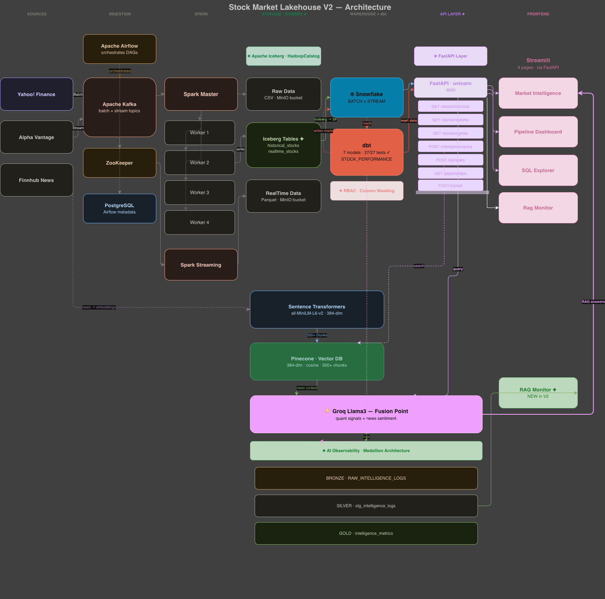
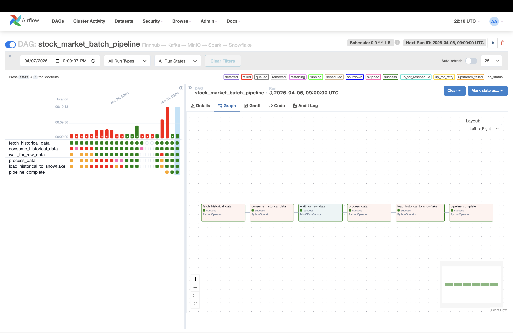
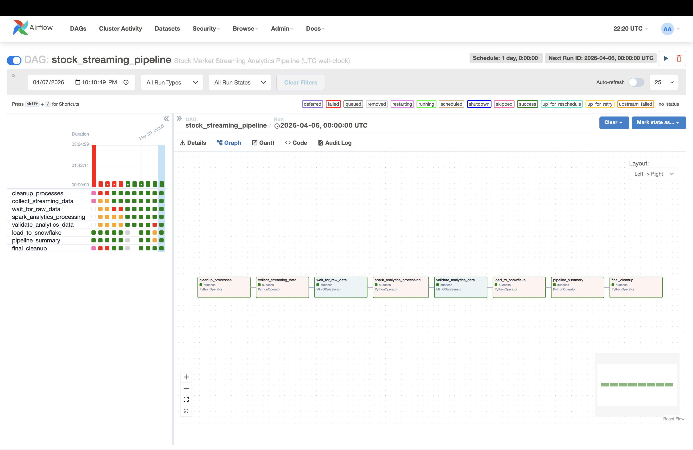

<div align="center">

# Stock Market Intelligence Pipeline V2

**A production-grade data engineering system that ingests, transforms, and analyses stock market data — then answers natural language questions about it using AI grounded in your own pipeline's output.**

[](https://github.com/atulpandey02/stock-market-rag-pipeline/actions)
[](https://python.org)
[](https://kafka.apache.org)
[](https://spark.apache.org)
[](https://airflow.apache.org)
[](https://snowflake.com)
[](https://getdbt.com)
[](https://docker.com)
[](https://iceberg.apache.org)
[](https://fastapi.tiangolo.com)
[](https://pinecone.io)
[](https://groq.com)
[](https://min.io)

<br/>

**9 Docker containers &nbsp;·&nbsp; 2 Airflow DAGs &nbsp;·&nbsp; 7 dbt models &nbsp;·&nbsp; 27 data quality tests &nbsp;·&nbsp; 7 FastAPI endpoints &nbsp;·&nbsp; 300+ Pinecone chunks &nbsp;·&nbsp; 10 stocks tracked**

<br/>

> *Tracks 10 major equities — AAPL · MSFT · GOOGL · AMZN · META · TSLA · NVDA · INTC · JPM · V*

</div>

---

## What's New in V2

| Feature | Status |
|---|---|
| **Apache Iceberg** — open table format replacing plain Parquet in MinIO | ✅ Done |
| **FastAPI layer** — 7 REST endpoints between Streamlit and all data sources | ✅ Done |
| **Snowflake RBAC** — 3 roles, 3 users, column masking on price data | ✅ Done |
| **Medallion architecture** — GenAI observability (BRONZE → SILVER → GOLD) | ✅ Done |
| **Semantic similarity monitoring** — track RAG search quality over time | ✅ Done |
| **NL2SQL** — ask questions in plain English, Groq generates SQL | ✅ Done |
| **4-page Streamlit app** — added RAG Monitor dashboard | ✅ Done |

---

## Table of Contents

- [How It Works](#how-it-works)
- [What Makes This Different](#what-makes-this-different)
- [Architecture](#architecture)
- [V2 New Features](#v2-new-features)
- [Pipeline in Action](#pipeline-in-action)
- [Tech Stack](#tech-stack)
- [Infrastructure](#infrastructure)
- [Project Structure](#project-structure)
- [Data Flow](#data-flow)
- [Snowflake Schema](#snowflake-schema)
- [dbt Quality Gates](#dbt-quality-gates)
- [FastAPI Endpoints](#fastapi-endpoints)
- [AI Observability](#ai-observability)
- [Key Engineering Decisions](#key-engineering-decisions)
- [Lessons Learned](#lessons-learned)
- [Getting Started](#getting-started)
- [Resume Bullets](#resume-bullets)

---

## How It Works

An 8-step end-to-end flow from raw market data to AI-grounded answers:

```
1. Airflow triggers daily  →  Kafka ingests OHLCV history from Finnhub API
2. Spark computes          →  SMA-5, SMA-20, daily returns, BUY/SELL signals
3. Iceberg stores          →  data as open table format on MinIO (s3a://)
4. Snowflake loads         →  from Iceberg paths via incremental MERGE
5. dbt transforms          →  raw tables into analytical marts (27 tests gate every run)
6. FastAPI serves          →  7 REST endpoints consumed by all Streamlit pages
7. Pinecone retrieves      →  300+ Finnhub news embeddings for semantic search
8. Groq Llama3 fuses       →  dbt quantitative signals + Pinecone news into grounded answers
```

---

## What Makes This Different

Most RAG projects pull from a static document store. This one is different — **the AI answers are grounded in data your pipeline computed, served through a production API layer**.

When you ask *"Should I buy AAPL?"* the system:

1. Calls `POST /api/v1/intelligence/query` on the FastAPI layer
2. FastAPI queries the `STOCK_PERFORMANCE` dbt mart for the latest SMA crossover signal
3. FastAPI searches Pinecone for the 5 most semantically relevant news chunks
4. FastAPI feeds both into Groq Llama3-70b — if quantitative signal conflicts with news sentiment, the model flags it explicitly
5. Every query is logged to the BRONZE observability layer for monitoring

```
📊 Pipeline Data — AAPL · 🟢 BUY · from dbt STOCK_PERFORMANCE
   Close: $293.32  |  SMA-5: $285.86  |  SMA-20: $273.21  |  Return: +1.14%

SIGNAL: BULLISH
CONFIDENCE: HIGH
REASONING: The quantitative pipeline shows a golden crossover with SMA-5 above
SMA-20 by $12.65, confirming bullish momentum. News sentiment from SeekingAlpha
is positive, citing resilient prospects and strong services growth.
RISK: A reversal below SMA-5 ($285.86) would invalidate the bullish signal.
```

This is also a Lambda architecture portfolio project — batch and streaming run simultaneously into two separate Snowflake databases, with a custom `MinIODataSensor` validating data landing before Spark ever runs.

---

## Architecture

<div align="center">
  
</div>

<br/>

The system runs two parallel pipelines that converge at the intelligence layer:

- **Batch pipeline** — fetches a full year of OHLCV history daily via Finnhub, writes Iceberg tables to MinIO, processes through Spark, loads into Snowflake via MERGE, and runs dbt transformations to produce BUY/SELL signals
- **Streaming pipeline** — generates real-time price ticks every 30 seconds, computes windowed aggregations via Spark Streaming, writes to Iceberg realtime tables, loads into a separate Snowflake database
- **FastAPI layer** — all Streamlit pages call FastAPI REST endpoints instead of connecting directly to Snowflake/Pinecone/Groq — credentials never leave the API layer
- **Intelligence layer** — the RAG engine synthesises quantitative pipeline signals from dbt AND financial news from Pinecone, logs every query to the Medallion observability layer

---

## V2 New Features

### 1. Apache Iceberg

Switched from plain Parquet to Apache Iceberg using HadoopCatalog on MinIO.

```python
# Spark config — 3 JARs baked into custom Dockerfile.spark
.config("spark.sql.extensions", "org.apache.iceberg.spark.extensions.IcebergSparkSessionExtensions")
.config("spark.sql.catalog.iceberg", "org.apache.iceberg.spark.SparkCatalog")
.config("spark.sql.catalog.iceberg.type", "hadoop")
.config("spark.sql.catalog.iceberg.warehouse", "s3a://stock-market-data/iceberg")
```

**Why Iceberg over plain Parquet:**
- Schema evolution without rewriting files
- Time travel (query data as of any point in time)
- ACID transactions on object storage
- Partition pruning without directory scanning

### 2. FastAPI Layer — 7 Endpoints

All Streamlit pages now call FastAPI instead of connecting directly to databases.

```
GET  /api/v1/health                           — service health check
GET  /api/v1/stocks/historical?symbol=AAPL    — OHLCV data
GET  /api/v1/stocks/realtime?symbol=AAPL      — windowed stream metrics
GET  /api/v1/stocks/signals?symbol=AAPL       — dbt BUY/SELL signals
GET  /api/v1/pipeline/kpis                    — pipeline health metrics
POST /api/v1/intelligence/query               — full RAG pipeline
POST /api/v1/sql/query                        — safe SQL passthrough
POST /api/v1/sql/ask                          — NL2SQL via Groq
```

**Why a FastAPI layer:**
- Credentials never reach the frontend
- One place to add caching, rate limiting, auth
- Testable endpoints (Swagger UI at `/docs`)
- Streamlit becomes a pure UI layer

### 3. Snowflake RBAC + Column Masking

Three-tier role hierarchy with dynamic column masking on price data.

```sql
-- Three roles with least-privilege access
ANALYST_ROLE    → SELECT only (FastAPI service account)
PIPELINE_ROLE   → INSERT/UPDATE (Spark/Airflow service account)
READ_ONLY_ROLE  → SELECT + masked price columns (SQL Explorer)

-- Dynamic masking policy on price columns
CREATE MASKING POLICY price_mask AS (val FLOAT) RETURNS FLOAT ->
    CASE
        WHEN CURRENT_ROLE() IN ('ANALYST_ROLE', 'PIPELINE_ROLE') THEN val
        ELSE 0.0   -- READ_ONLY_ROLE sees 0.0 instead of real prices
    END;
```

### 4. Medallion Architecture for GenAI Observability

Every intelligence query is logged and transformed through three layers:

```
BRONZE  →  RAW_INTELLIGENCE_LOGS
           Raw event: question, symbol, Pinecone results (JSON),
           Groq response, latency_ms, model, timestamp

SILVER  →  stg_intelligence_logs (dbt view)
           Cleans data, extracts similarity scores from JSON,
           calculates speed categories, derives response length

GOLD    →  intelligence_metrics (dbt table)
           Daily aggregates: avg_similarity_score, avg_latency_ms,
           slow_queries, sentiment distribution, total_queries per symbol
```

**What this enables:** Track when semantic search quality degrades (similarity score drops), detect slow queries, monitor sentiment trends over time.

### 5. NL2SQL

Ask questions in plain English — Groq generates the SQL, executes it, and shows both.

```
User: "Which stocks have a BUY signal right now?"
    ↓
Groq generates:
SELECT SYMBOL, TRADE_DATE, CLOSE_PRICE, OVERALL_SIGNAL
FROM STOCK_PERFORMANCE
WHERE OVERALL_SIGNAL = 'BUY'
ORDER BY SYMBOL;
    ↓
Executes on Snowflake → returns results
```

Safety: Temperature=0 for deterministic generation, SELECT-only validation, blocks all DML keywords.

---

## Pipeline in Action

### Orchestration — Airflow DAGs

<div align="center">
  <table>
    <tr>
      <td align="center" width="50%">
        
        <br/><sub><b>Batch pipeline — all 6 tasks green</b></sub>
      </td>
      <td align="center" width="50%">
        
        <br/><sub><b>Streaming pipeline — all 8 tasks green</b></sub>
      </td>
    </tr>
  </table>
</div>

### Streamlit — 4-Page Dashboard

**Page 1 — Market Intelligence (RAG Chat)**

RAG chat grounded in live dbt pipeline signals + Pinecone news. Shows SIGNAL, CONFIDENCE, REASONING, RISK. Color-coded pipeline metrics card per stock.

**Page 2 — Pipeline Dashboard**

Real-time KPIs, color-coded BUY/SELL signals table (green=BULLISH, red=BEARISH), price history chart, top movers, data quality checks.

**Page 3 — SQL Explorer**

Two modes: Natural Language (type plain English → Groq generates SQL) and Manual SQL (write raw SQL with preset queries). Shows generated SQL for transparency.

**Page 4 — RAG Monitor (new in V2)**

Medallion architecture observability dashboard. Shows semantic similarity scores by symbol, latency analysis, sentiment distribution, recent queries from BRONZE layer.

### Data Quality — dbt Lineage

<div align="center">
  <table>
    <tr>
      <td align="center" width="50%">
        
        <br/><sub><b>dbt — 7 models, 27 passing tests</b></sub>
      </td>
      <td align="center" width="50%">
        
        <br/><sub><b>Pinecone — 300+ embedded financial news chunks</b></sub>
      </td>
    </tr>
  </table>
</div>

---

## Tech Stack

| Layer | Technology | Notes |
|---|---|---|
| Message broker | Apache Kafka | Dual topics: `batch-stock-data` + `realtime-stock-data` |
| Data lake | MinIO + Apache Iceberg | HadoopCatalog, s3a://, ACID transactions |
| Processing | Apache Spark 3.5.1 | Batch transforms + windowed stream aggregations |
| Warehouse | Snowflake | Two databases, incremental MERGE, RBAC, column masking |
| Transformation | dbt | 7 models (5 original + 2 observability), 27 tests |
| Orchestration | Apache Airflow 2.9.3 | Custom MinIO sensors, retry logic |
| API layer | FastAPI + uvicorn | 8 endpoints, Pydantic models, rate limiting |
| Vector DB | Pinecone | 300+ embedded financial news chunks, 384-dim |
| Embeddings | sentence-transformers/all-MiniLM-L6-v2 | Free, local, no API key |
| LLM | Groq Llama3.3-70b | Few-shot + chain-of-thought prompting |
| NL2SQL | Groq + schema context | Plain English → validated Snowflake SQL |
| UI | Streamlit | 4-page dashboard with clickable home page |
| Infrastructure | Docker Compose | 9 containerised services |
| CI/CD | GitHub Actions | Syntax checks, unit tests, dbt validation |

---

## Infrastructure

### Docker Services (9 containers)

```yaml
services:
  zookeeper         # Kafka coordination
  kafka             # Message broker — batch + realtime topics
  minio             # Object storage — Iceberg warehouse
  spark-master      # Spark coordinator
  spark-worker      # 3 workers (configurable)
  spark-client      # Job submission
  airflow-webserver # DAG UI at localhost:8080
  airflow-scheduler # DAG execution engine
  postgres          # Airflow metadata store
```

### Local Services (outside Docker)

```
FastAPI (uvicorn)     # src/api/main.py — localhost:8000
Streamlit             # src/rag/app.py — localhost:8501
dbt                   # src/dbt/ — runs in dbt_venv
```

---

## Project Structure

```
stockmarketdatapipeline_v2/
├── src/
│   ├── api/                          # FastAPI layer (NEW in V2)
│   │   ├── main.py
│   │   ├── config.py
│   │   ├── models/
│   │   │   ├── requests.py
│   │   │   └── responses.py
│   │   ├── routers/
│   │   │   ├── health.py
│   │   │   ├── stocks.py
│   │   │   ├── pipeline.py
│   │   │   ├── intelligence.py
│   │   │   └── sql.py
│   │   └── services/
│   │       ├── snowflake.py
│   │       ├── pinecone_svc.py
│   │       ├── groq_svc.py
│   │       ├── nlsql_svc.py          # NL2SQL (NEW in V2)
│   │       ├── logging_svc.py        # Observability (NEW in V2)
│   │       └── cache.py
│   ├── airflow/
│   │   └── dags/
│   │       ├── stock_market_batch_pipeline.py
│   │       └── stock_streaming_pipeline.py
│   ├── dbt/
│   │   └── models/
│   │       ├── staging/
│   │       │   ├── stg_historical_stock.sql
│   │       │   ├── stg_realtime_stock.sql
│   │       │   └── stg_intelligence_logs.sql   # NEW in V2
│   │       └── marts/
│   │           ├── stock_daily_metrics.sql
│   │           ├── stock_performance.sql
│   │           ├── stock_realtime_summary.sql
│   │           └── intelligence_metrics.sql     # NEW in V2
│   ├── kafka/
│   ├── spark/
│   └── rag/
│       ├── app.py
│       ├── rag_pipeline.py
│       └── pages/
│           ├── 1_Market_Intelligence_App.py
│           ├── 2_Pipeline_Dashboard.py
│           ├── 3_Sql_Explorer.py
│           └── 4_Rag_Monitor.py                # NEW in V2
├── Dockerfile.spark                            # Custom JARs (Iceberg)
├── docker-compose.yaml
└── requirements-api.txt
```

---

## Data Flow

```
Yahoo Finance / Alpha Vantage / Finnhub
    ↓ (Kafka batch + realtime topics)
Apache Kafka
    ↓
Apache Spark (batch_processor.py / stream_batch_processor.py)
    ↓
MinIO — Apache Iceberg tables
    s3a://stock-market-data/iceberg/stock_market/historical_stocks
    s3a://stock-market-data/iceberg/stock_market/realtime_stocks
    ↓
Snowflake (incremental MERGE)
    STOCKMARKETBATCH.PUBLIC.HISTORICAL_STOCK
    STOCKMARKETSTREAM.PUBLIC.REALTIME_STOCK
    ↓
dbt (7 models, 27 tests)
    STOCK_PERFORMANCE → BUY/SELL signals
    INTELLIGENCE_METRICS → RAG observability
    ↓
FastAPI (8 endpoints)
    ↓
Streamlit (4 pages)
    ↑
Pinecone (300+ news chunks) ──────── Groq Llama3.3-70b
    ↑
Finnhub news → sentence-transformers embeddings
```

---

## Snowflake Schema

### STOCKMARKETBATCH.PUBLIC

| Table | Key Columns | Description |
|---|---|---|
| `HISTORICAL_STOCK` | SYMBOL, DATE, OHLCV, SMA_5, SMA_20 | Raw batch data from Spark |
| `STOCK_PERFORMANCE` | SYMBOL, TRADE_DATE, OVERALL_SIGNAL, SMA_SIGNAL | dbt mart — BUY/SELL signals |
| `STOCK_DAILY_METRICS` | SYMBOL, DATE, DAILY_RETURN_PCT | dbt mart — derived metrics |
| `RAW_INTELLIGENCE_LOGS` | LOG_ID, QUESTION, SYMBOL, PINECONE_RESULTS, LATENCY_MS | BRONZE observability layer |

### STOCKMARKETSTREAM.PUBLIC

| Table | Key Columns | Description |
|---|---|---|
| `REALTIME_STOCK` | SYMBOL, WINDOW_START, MA_15M, MA_1H, VOLATILITY_15M | Spark windowed aggregations |

---

## dbt Quality Gates

27 tests run after every pipeline execution. Any failure stops the pipeline before bad data reaches consumers.

```sql
-- Built-in dbt tests
not_null           → symbol, date, close_price, volume
accepted_values    → symbol in 10 tracked stocks only

-- Custom SQL tests
assert_high_gte_low        → high_price >= low_price always
assert_price_not_negative  → close_price > 0 always
assert_no_future_dates     → date <= current_date always
assert_expected_symbols    → exactly 10 stocks, no drift
```

---

## FastAPI Endpoints

All endpoints documented at `http://localhost:8000/docs` (Swagger UI).

| Method | Endpoint | Description |
|---|---|---|
| `GET` | `/api/v1/health` | Health check for all services |
| `GET` | `/api/v1/stocks/historical` | OHLCV + SMA data |
| `GET` | `/api/v1/stocks/realtime` | Latest windowed stream metrics |
| `GET` | `/api/v1/stocks/signals` | dbt BUY/SELL signals |
| `GET` | `/api/v1/pipeline/kpis` | Aggregated pipeline health |
| `POST` | `/api/v1/intelligence/query` | Full RAG pipeline |
| `POST` | `/api/v1/sql/query` | Safe SQL passthrough (SELECT only) |
| `POST` | `/api/v1/sql/ask` | NL2SQL — plain English to SQL |

---

## AI Observability

Every intelligence query is automatically logged and monitored.

### What gets logged (BRONZE)

```json
{
  "question": "What is the outlook for AAPL?",
  "symbol": "AAPL",
  "pinecone_results": [...],
  "groq_response": "SIGNAL: BULLISH...",
  "latency_ms": 2419,
  "model": "llama-3.3-70b-versatile"
}
```

### What gets monitored (GOLD — `intelligence_metrics`)

| Metric | What it tells you |
|---|---|
| `avg_similarity_score` | Pinecone search quality — drop indicates index degradation |
| `avg_latency_ms` | Response time trend — spike indicates service issue |
| `slow_queries` | Count of queries taking >8 seconds |
| `positive_results` | News sentiment distribution per stock |
| `total_queries` | Usage volume per symbol per day |

### Hallucination prevention

Three complementary layers:
1. **RAG grounding** — Groq only sees real data (Pinecone + dbt), cannot use external knowledge
2. **Structured prompting** — Few-shot examples + chain-of-thought + SIGNAL/CONFIDENCE/REASONING format
3. **Semantic monitoring** — Track similarity scores; low scores flag potentially irrelevant context

---

## Key Engineering Decisions

**Why Iceberg over plain Parquet?**
Schema evolution, time travel, and ACID transactions on object storage. When the batch pipeline retries, Iceberg handles concurrent writes without corruption. With plain Parquet, partial writes leave corrupt files.

**Why FastAPI between Streamlit and data sources?**
Credentials never reach the frontend. One place to add caching, auth, and rate limiting. Streamlit becomes a pure UI layer — swap Snowflake for Databricks without changing a single page file.

**Why MERGE instead of INSERT?**
Idempotency — if Airflow retries a failed task, MERGE updates existing rows instead of creating duplicates. Critical for production pipelines where task reruns are expected.

**Why custom MinIO sensor instead of time-based wait?**
A time-based sleep is fragile. The custom `MinIODataSensor` polls every 30 seconds and only unblocks Spark when files are confirmed present — preventing silent failures on empty partitions.

**Why sentence-transformers instead of OpenAI embeddings?**
Free, runs locally, no API key, no rate limits. `all-MiniLM-L6-v2` at 384 dimensions is fast on CPU and sufficient for financial news retrieval.

**Why separate Snowflake databases for batch and stream?**
Different update patterns and SLAs. Batch loads once daily with full MERGE semantics. Stream loads every few minutes with window-based keys. Separating them prevents schema conflicts and makes access control simpler.

**Why temperature=0 for NL2SQL?**
SQL generation must be deterministic. Same question should always produce the same query. Temperature=0 eliminates randomness — critical when the output is executable code.

---

## Lessons Learned

| Problem | Root Cause | Fix |
|---|---|---|
| Silent data loss in Snowflake | UTC/EST timezone mismatch | Standardised to `datetime.now(timezone.utc)` everywhere |
| MinIO sensor checking wrong date | `context['ds']` returns logical schedule date | Changed sensor to use `datetime.now(UTC)` directly |
| Kafka consumer crashes on startup | `group.id=None` — env var missing | Added `KAFKA_GROUP_BATCH_ID` to `x-airflow-common` |
| Spark `PATH_NOT_FOUND` | `recursiveFileLookup` treated single CSV as directory | Switched to glob pattern |
| FastAPI wrong uvicorn binary | `/opt/anaconda3/bin/uvicorn` instead of venv | Use `python -m uvicorn` always |
| Shell env vars overriding `.env` | Old credentials exported in `~/.zshrc` | Removed exports; use `load_dotenv(override=True)` |
| `PARSE_JSON()` in VALUES clause fails | Snowflake doesn't allow function calls in VALUES | Changed to `INSERT INTO ... SELECT` pattern |
| Pydantic field mismatch | Streamlit sent `symbol_filter`, model expected `symbol` | Matched field names to Pydantic model exactly |
| LaTeX rendering in Streamlit | `st.write()` interprets `$293.32` as math | Use `st.markdown(text.replace("$", "\\$"))` |

---

## Getting Started

> Full setup takes approximately 20–25 minutes including Docker pulling all images.

### Prerequisites

| Requirement | Where to get it |
|---|---|
| Docker Desktop | [docker.com/products/docker-desktop](https://docker.com/products/docker-desktop) |
| Snowflake account | [snowflake.com](https://snowflake.com) — free 30-day trial |
| `FINNHUB_API_KEY` | [finnhub.io](https://finnhub.io) — free tier |
| `PINECONE_API_KEY` | [app.pinecone.io](https://app.pinecone.io) — free starter plan |
| `GROQ_API_KEY` | [console.groq.com](https://console.groq.com) — free tier |

### Environment Variables

```bash
# Snowflake
SNOWFLAKE_ACCOUNT=your_account_identifier
SNOWFLAKE_USER=your_username
SNOWFLAKE_PASSWORD=your_password
SNOWFLAKE_WAREHOUSE=COMPUTE_WH
SNOWFLAKE_ROLE=ACCOUNTADMIN

# API keys
FINNHUB_API_KEY=your_finnhub_key
PINECONE_API_KEY=your_pinecone_key
PINECONE_INDEX_NAME=stock-market-rag
GROQ_API_KEY=your_groq_key

# App
API_BASE_URL=http://localhost:8000
```

### Run It

```bash
# 1. Clone
git clone https://github.com/atulpandey02/stock-market-rag-pipeline.git
cd stock-market-rag-pipeline

# 2. Configure
cp .env.example .env
# Fill in your credentials

# 3. Start all 9 Docker services
docker-compose up -d

# 4. Trigger batch pipeline
# Open Airflow UI → http://localhost:8080 (admin / admin)
# Find stock_market_batch_pipeline → click ▶ Trigger

# 5. Run dbt transformations
cd src/dbt
source ../../dbt_venv/bin/activate
dbt run
dbt test

# 6. Start FastAPI
cd src
python -m uvicorn api.main:app --reload --host 0.0.0.0 --port 8000

# 7. Ingest news and launch Streamlit
cd src/rag
python rag_pipeline.py     # fetches Finnhub news → Pinecone (~2 min)
streamlit run app.py       # opens at http://localhost:8501
```

---

<div align="center">

**Atul Kumar Pandey**

[GitHub](https://github.com/atulpandey02) &nbsp;·&nbsp; [LinkedIn](https://www.linkedin.com/in/atulpandey02/)

Released under the [MIT License](LICENSE)

</div>